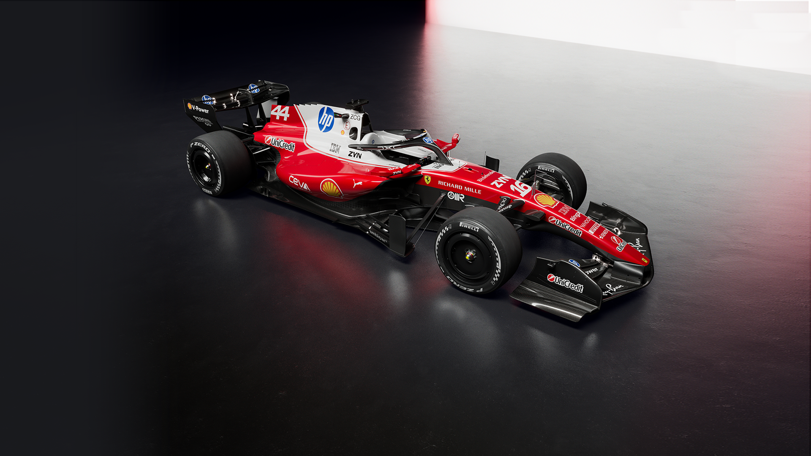

<!-- Background Banner -->

---

# 👋 Hi, I'm @Cedrick250 — Cédric MUNEZERO

### 🌐 Cybersecurity | Cloud & IT Operations | Digital Transformation

---

## 🧠 About Me

- 🌸 I'm passionate about **cybersecurity**, **IT operations**, and **digital transformation**
- 🔧 I've gained hands-on experience through internships in **tech support**, **threat detection**, **system maintenance**, and **cloud computing**
- 🌱 Currently exploring platform deployment tools like **Docker & Kubernetes**, and currently learning **Golang**
- 💛 I'm open to collaborating on projects focused on **ethical IT solutions**, **secure infrastructure**, and **technical innovation**
- 📫 Reach me at:  

---

## 🛠️ Tech Stack & Tools

---

## 📊 GitHub Stats

---

## 🏆 GitHub Trophies

---

## 📈 Contribution Graph

---

### 💬 *"Security is not a product, but a process."* — Bruce Schneier

